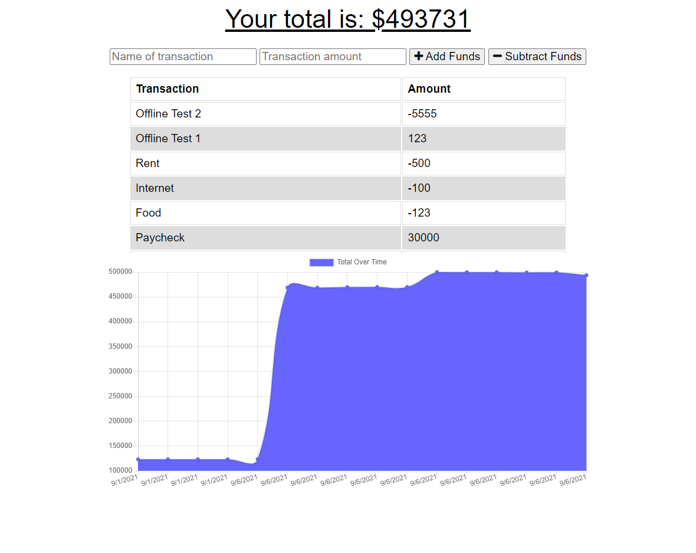

# Budget Tracker
  

  ## Description
  This is an app that will let you track your budget. And will persist its data when offline.

  
  ## Table of Contents
  * [Installation](#installation)
  * [Usage](#usage)
  * [License](#license)
  * [Contributing](#contributing)
  * [Tests](#tests)
  * [Questions](#questions)
  

  ## Installation
  You will need Node.js. Use "npm install" to install the packages. 

  ## Usage
  
  
  ## License
  Licensed under the [MIT](https://opensource.org/licenses/MIT) license. 

  Copyright 2021
  

  ## Contributing
  bobswiftfoot

  ## Tests
  No tests

  ## Questions
  Github Profile: [bobswiftfoot](https://github.com/bobswiftfoot)

  Email any questions to: [natepfau@yahoo.com](mailto:natepfau@yahoo.com)
  